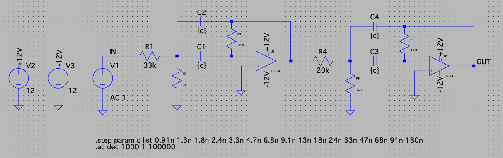

# 

The `OHMCODER` is a 16 channel fully analog vocoder, housed in a 3U 19"
enclosure with a full patch bay and feed-through functionality.

This project is inspired by [this](https://www.instructables.com/Build-an-analog-vocoder/) instructables project by user [planetone](https://www.instructables.com/member/planetone/).

## Overview

In vocoders, a program and carrier signal are filtered into a number of
frequency bands. The envelope of the program signal bands then modulates
the carrier signal bands. Finally, the per-band contributions are summed
back together to get the vocoded output.

The core of the design thus made up of

- [Bandpass Filters](#multiple-feedback-infinite-gain-bandpass-filters)
- [Envelope Followers](#envelope-followers)
- [Voltage Controlled Amplifiers](#ota-voltage-controlled-amplifiers)

## Features

<!-- TODO -->

- Jack and XLR Input
- Patch Bay
- Per-Band Gain Control with LED Indicators
- Program or Carrier Band Feed-Through and/or Mixing
- Stereo and Mono Jack Output

## Circuits

### Multiple-Feedback Infinite Gain Bandpass Filters

We used the same second order multiple-feedback infinite-gain active
bandpass filters as in the instructibles project. TL074 quad opamps are
used.

Notice, that the nice thing about these filters is, that we only need to
change the capacitor values to get different center frequencies, as seen
in the SPICE simulation below.

#### Capacitor Values

| Band | f_low [Hz] | f_high [Hz] | C [nF] |
| ---- | ---------- | ----------- | ------ |
| 01   | 65         | 105         | 0.91   |
| 02   | 90         | 150         | 1.3    |
| 03   | 125        | 200         | 1.8    |
| 04   | 175        | 285         | 2.4    |
| 05   | 255        | 400         | 3.3    |
| 06   | 345        | 555         | 4.7    |
| 07   | 465        | 755         | 6.8    |
| 08   | 635        | 1050        | 9.1    |
| 09   | 920        | 1455        | 13     |
| 10   | 1220       | 1960        | 18     |
| 11   | 1765       | 2880        | 24     |
| 12   | 2500       | 4075        | 33     |
| 13   | 3515       | 5605        | 47     |
| 14   | 4640       | 7550        | 68     |
| 15   | 6375       | 10375       | 91     |
| 16   | 9200       | 15000       | 130    |

### Envelope Followers

This is where we depart from planetone's design. We use a low-pass
filtered precision rectifier signal to follow the program envelope.

The majority of the spectral energy of speech amplitude modulation lies
below about 15Hz, i. e. the mean time between syllables is about
1/15Hz (see [speech_modulation.ipynb](./auxiliary/notebooks/speech_modulation.ipynb) for an example). The filter is chosen such that we follow this
amplitude modulation.

### OTA Voltage Controlled Amplifiers

We use VCAs based on the LM13700 quad operational transconductance
amplifier, making use of its linearizing diodes and the integrated
buffer circuits.

The program envelope controls the amplifier gain via a voltage to
current converter circuit.

